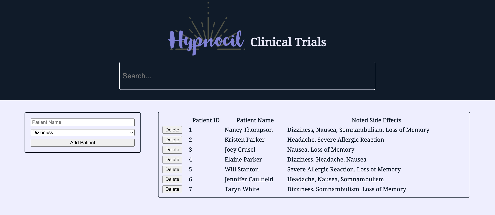

# Hypnocil Clinical Trials




You've recently been hired as a new physician's assistant at Westin Hills Psychiatric Hospital in Springwood, Ohio. They've been running clinical trials on a new drug called Hypnocil. The FDA has deemed Hypnocil as an experimental treatment that is effective for management of psychotic disorders. It's used For sedation where dreamless sleep is considered optimal.

The patients are adolescents that are suffering extreme and troubling night terrors of a severely burned man wearing a red and green sweater with long knives as claws.

Having been through Flatiron School you've been tasked with creating a web portal to track any side effects being experienced by the patients.

## Instructions

For this project, you’ll be building out a React application that displays a
list of patients. Try your best to find the right places to insert code into the established code base.

Part of what this code challenge is testing is your ability to follow given instructions. While you will definitely have a significant amount of freedom in how you implement the features, be sure to carefully read the directions for setting up the application.

## Setup

1. Run `npm install` in your terminal.
2. Run `json-server --watch src/db.json`. This will run your backend on port `3000`.
3. In a new terminal, run `npm start`. You may be asked whether you want to run react on another port. Type 'y' and it should open the page.

Make sure to open [http://localhost:3000/patients](http://localhost:3000/patients) in the browser to verify that your backend is working before you proceed!

The base URL for your backend is: `http://localhost:3000`.

## Core Deliverables

As a user, I should be able to:

- See all patients and patient data in the table when the page loads
- Create a new patient with a given side effect. This patient should persist through refreshes.
- You should be able to the table by typing the search box. The filter should work on both the name and the side effects.
- Clicking the delete button should remove the patient from the page. This change should persist through refreshes.
- Create some visual indicator of whether a patient is alive or deceased.
### Example Response:

```json
[
  {
    "id": 1,
    "name": "Nancy Thompson",
    "deceased": false,
    "side_effects": [
      "Dizziness",
      "Nausea",
      "Somnambulism",
      "Loss of Memory"
    ]
  },
  {
    "id": 2,
    "name": "Kristen Parker",
    "deceased": false,
    "side_effects": [
      "Headache",
      "Severe Allergic Reaction"
    ]
  }
]
```